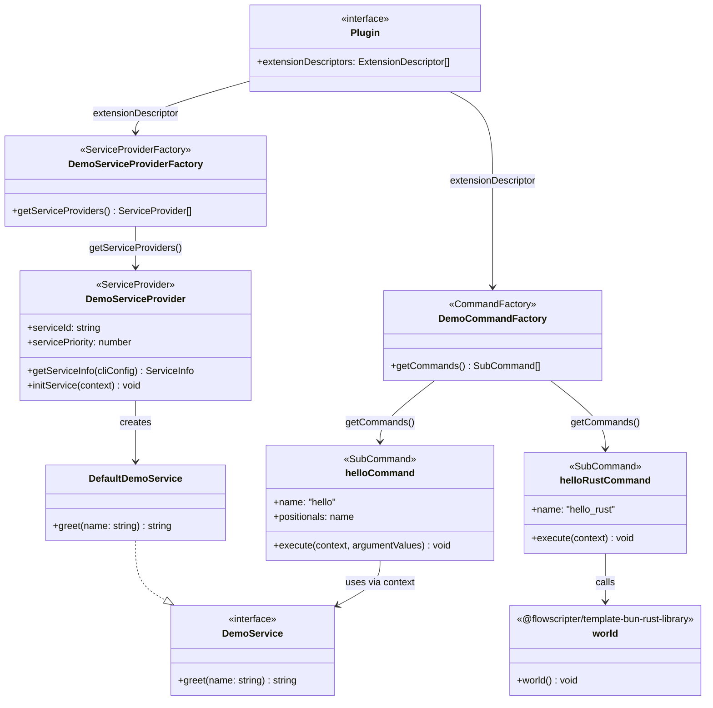

# example-cli-plugin

> Example CLI plugin for the
> [dynamic-cli-framework](https://github.com/flowscripter/dynamic-cli-framework)

This plugin is authored against
[`@flowscripter/dynamic-cli-framework-api`](https://github.com/flowscripter/dynamic-cli-framework-api),
the lightweight plugin-facing API package, rather than the full
`dynamic-cli-framework` - keeping the framework's concrete service
implementations and their dependencies out of the plugin's own
dependency tree.

## Development

Build (produces `dist/` for Node.js and TypeScript consumers; Bun uses raw source directly):

`bun run build`

Test:

`bun test`

Format:

`bunx oxfmt`

Lint:

`bunx oxlint index.ts src/ tests/`

Generate HTML API Documentation:

`bunx typedoc index.ts`

## Documentation

### Overview

### Framework API

Refer to the
[dynamic-cli-framework](https://github.com/flowscripter/dynamic-cli-framework)
for an overview of what this example is demonstrating.

### API

Link to auto-generated API docs:

[API Documentation](https://flowscripter.github.io/example-cli-plugin/index.html)

## License

MIT © Flowscripter
